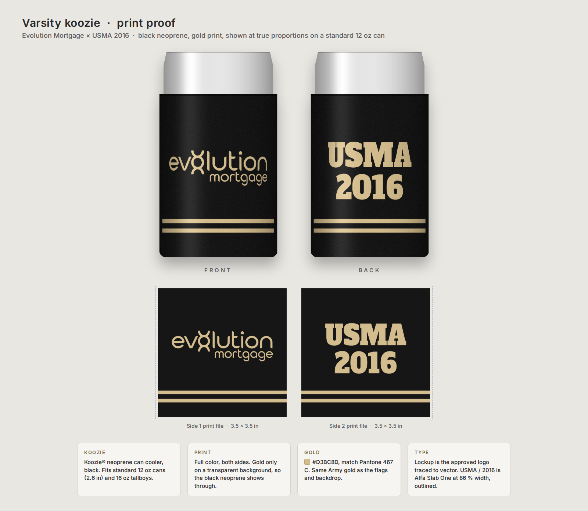

# Evolution Mortgage × USMA 2016 – varsity koozie

Black neoprene can cooler, Army gold print on both sides: the Evolution Mortgage lockup on the front, **USMA / 2016** on
the back, and a double varsity stripe near the bottom of each side. Gold `#D3BC8D` (Pantone 467 C), the same Army gold as
the tailgate flag and backdrop.

## Where to order: myKoozie.com (official Koozie® store)

**Product:** Custom Koozie® Neoprene Can Cooler | **Full Color 2 Sides**, body color **Black**.
<https://www.mykoozie.com/full-color-custom-koozie-2-sided-neoprene-can-cooler>
For 300 or more, the bulk listing is cheaper: <https://www.mykoozie.com/koozie-neop-can-bulk-fullc-2side>

| Quantity | Price each (no-minimum listing) |
| --- | --- |
| 1 | $7.99 |
| 100+ | $5.19 |
| 150+ | $4.79 |
| 280+ | $4.00 |
| 300+ (bulk listing) | $3.99 |

Prices and terms as listed on 2 October 2026. Print area 3.5 × 3.5 in per side, ships in about 2 business days (orders
of 200+ can take a few days longer), no setup fee.

Why this one:

- It is the Koozie® brand's own store, so the body is the genuine standard 12 oz Koozie®, not a look-alike sized by guesswork.
- It prints **both sides** on a **black** body with the largest print area found (3.5 × 3.5 in), which the varsity layout needs.
- No minimum, so one or two can be ordered first to try on the actual beer.

Checked and ruled out (2 October 2026):

| Site | Why not |
| --- | --- |
| 4imprint, Koozie® Neoprene Collapsible Can Cooler #131606 | Black is out of stock; 2.5 × 2.625 in print area. |
| Quality Logo Products, Collapsible Neoprene KOOZIES® | Black available, but prints one side only (3 × 2.5 in). |
| Custom Ink, Full Color Koozie® Neoprene | Not offered in black (the maker lists white as the standard color). |

## Will it fit a beer can?

- A standard 12 oz beer can is **66 mm (2.6 in) wide** and 122 mm tall (Crown and Ball specs). Bud Light, Coors Light,
  Miller Lite and most canned beer use it. The standard Koozie® neoprene cooler is built for that can (about 2.75 in
  across, 3.88 in tall) and also takes 16 oz tallboys, which are the same width.
- **Avoid anything named "Slim".** Slim and sleek 12 oz cans are about 57–58 mm (2.25 in) wide: White Claw, Truly,
  High Noon, and Custom Ink also lists Michelob Ultra among slim-can brands. A slim koozie will not go on a regular beer
  can, and a regular koozie is loose on a slim can.
- If the cooler will be heavy on seltzers, order a small batch of the slim version as well; the artwork needs a quick
  re-layout for its taller, narrower print area.

## Files

| File | Use |
| --- | --- |
| `…-side1-front-3.5in-600dpi.png` | **Upload as Side 1.** Lockup + stripes, gold on transparent, 2100 × 2100 px. |
| `…-side2-back-3.5in-600dpi.png` | **Upload as Side 2.** USMA / 2016 + stripes. |
| `…-3.5in.pdf`, `…-3.5in.svg` | Same art as vector, in case the printer asks for vector files. |
| `proof-varsity-koozie.png`, `preview-*.png` | Approval proof: both sides wrapped on a 12 oz can at true proportions. |
| `alternates/with-nmls/` | Front with the Equal Housing house icon and `NMLS #2432729` under the lockup, if compliance wants it on promo items. |
| `source/` | Generator (`make_koozie.py`), can preview (`koozie_preview.py`) and the two fonts. |

### Upload steps on myKoozie

1. Open the Full Color 2 Sides listing and choose **Black**.
2. Upload the Side 1 PNG for the front and the Side 2 PNG for the back.
3. Stretch each image to fill the 3.5 × 3.5 in box edge to edge. The stripes are meant to run the full width.
4. In the order notes, ask them to keep the gold close to Pantone 467 C.
5. Approve the proof promptly; production starts after approval.

Notes:

- The two sides print separately, so the stripes stop just short of the side seams rather than circling unbroken.
  Unbroken stripes need an all-over sublimated koozie, where the black is printed on white material and can look grayish
  where it stretches.
- Some printers treat "USMA" as a trademark and ask for permission before printing it. Have a class or sponsorship
  contact ready if the proof team asks.

## Design notes

- Layout proportions are measured from the approved varsity mockup and mapped onto a real 3.88 in tall can cooler with the
  print area centred: lockup 2.75 in wide centred at 1.57 in; USMA / 2016 in Alfa Slab One at 86 % width, 0.59 in caps;
  stripes 0.10 in thick with a 0.125 in gap, starting 2.79 in down the print area.
- Alfa Slab One is free and is also in Canva, if anyone rebuilds the back there (Canva cannot condense it to 86 %; the
  outlined files here already are).
- Regenerate with `python3 source/make_koozie.py [print area in] [face height in]`. It imports the traced logo from
  `../evolution-mortgage-tailgate-flag/source/make_flag.py`; run it from a folder holding that module, its `build/` logo
  paths and a `fonts/` folder with the two TTFs.
